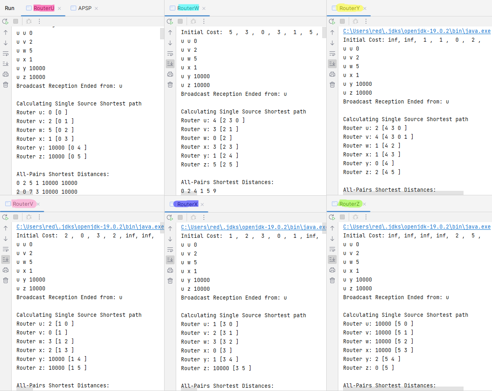
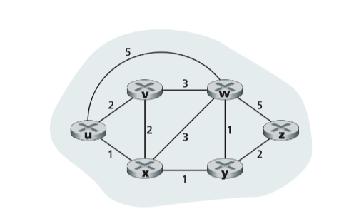
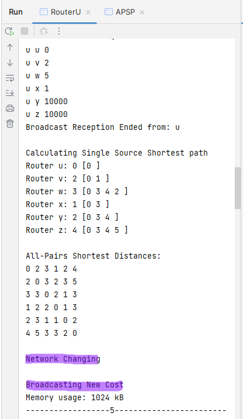
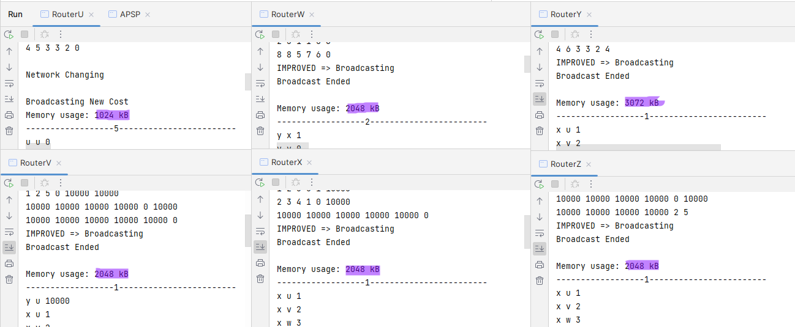

# Introduction

The Link State Algorithm is a fundamental concept in the field of
computer networking that plays a vital role in the efficient routing of
data packets across the network. The algorithm works by creating a
network topology map, which includes information about the state of all
the links in the network. This information is then used to determine the
best path for data to travel between nodes in the network.

In this lab experiment, our objective was to develop a deeper
understanding of the Link State Algorithm by implementing it in a
simulated network environment. We aimed to gain practical experience
with the algorithm and learn about its applications in computer
networks.

Throughout the experiment, we familiarized ourselves with the Link State
Algorithm's implementation and studied its impact on network
performance. We also learned about various network metrics, such as
bandwidth and delay, that can affect the algorithm's routing decisions.
By implementing the algorithm, we gained insight into how it works and
developed a deeper understanding of its strengths and limitations.

# Objectives

- To implement a program that simulates a network of routers using the
  Link State Algorithm.

- To create a network topology using Link State Packets and flooding
  to update neighbors.

- To maintain and update the network topology based on LSPs, where the
  cost changes randomly after a certain time interval.

- To output All pair Shortest Paths for each node.

- To analyze the performance of the algorithm in terms of time
  complexity and memory usage.

- To test the functionality of the Link State Algorithm in various
  network scenarios by changing the network topology and evaluating
  the calculated shortest paths.

# Theory

In computer networking, routing is the process of determining the path
taken by data packets between nodes in a network. Routing algorithms are
responsible for finding the shortest and most efficient path for data to
travel through the network.

Two commonly used algorithms for routing in computer networks are
Dijkstra's algorithm and Floyd-Warshall algorithm.

Dijkstra's algorithm is a greedy algorithm that operates by calculating
the shortest path from a starting node to all other nodes in the
network. It works by maintaining a set of unvisited nodes and selecting
the node with the smallest distance from the starting node to visit
next. This process continues until all nodes have been visited, and the
shortest path to each node is calculated.

The Floyd-Warshall algorithm, on the other hand, is a dynamic
programming algorithm that calculates the shortest path between all
pairs of nodes in a network. It works by iterating through all nodes in
the network and calculating the shortest path between each pair of
nodes. The algorithm builds a matrix that stores the shortest path
distance between each pair of nodes, which can be used to determine the
shortest path between any two nodes in the network.

In the context of this lab experiment, we implemented the Link State
Algorithm using Dijkstra's algorithm to calculate the shortest path
between nodes in the network. We also analyzed the performance of the
algorithm in terms of time complexity and memory usage. Furthermore, we
tested the functionality of the Link State Algorithm by changing the
network topology and evaluating the calculated shortest paths.

# Methodology

The methodology for this lab project report involved the following
steps:

- **Design and Implementation of the Network Topology:** We designed a
  program that simulates a network of routers, where each router is
  represented as a node and each link as an edge with a given cost.
  Each router had a mapping of port and router names. We then
  implemented the Link State Algorithm to create a network topology,
  including the creation of Link State Packets (LSP) containing the
  cost of immediate edges, and sending them to all neighbors. After a
  node received a new message, it ran Dijkstra's algorithm to
  calculate the shortest path to all other nodes.

- **Maintenance and Updating of the Network Topology :** We also
  implemented the maintenance and updating of the network topology
  based on LSPs. We randomly changed the cost of the edges after a
  certain time interval and updated the network topology by
  broadcasting new LSPs.

- **Output of All Pair Shortest Paths :** We modified the program to
  output All pair Shortest Paths for each node.

- **Performance Analysis :** We analyzed the performance of the
  algorithm in terms of memory usage by measuring the memory usage.

- **Testing of Link State Algorithm :** We tested the functionality of
  the Link State Algorithm in various network scenarios by changing
  the network topology and evaluating the calculated shortest paths.
  This was done by using a 30-second timer that randomly updated an
  edge in the network.

# Experimental result

We have 6 routers in network topology (Figure 1).

Initially they are in the configuration as shown in Figure 2.

As we can see from, figure 1, Router U first transmit it's neighbor's
information to all the other routers. The log from the Router W is
provided below:

As we can see, This router first receives the braodcast, then using
dijkstra calculates the shortest distance and also all pair shortest
parth. After that, it realizes that the cost has improved, so it
broadcasts the information again.

After some interval, the we are randomly changing the cost. If we look
at the logs of router U at broadcast no 5 (Figure 4) we can see that,
after changing the network information we're once again broadcasting the
information.

Finally, we can see the memory usage, of every router after every
broadcast received. As we can see from Figure 5, memory usage varies
between 1MB to 3MB.

# Experiences

During the lab experiment, we gained valuable experience in implementing
the Link State Algorithm and simulating a network of routers. We were
able to apply the theoretical concepts learned in class to a practical
scenario and understand the challenges involved in designing and
maintaining a network topology. Some of our experiences during the lab
experiment include:

- Designing the network topology involved mapping out the routers and
  their connections. This required a good understanding of the network
  architecture and the ability to visualize the topology in our minds.

- Implementing the Link State Algorithm involved coding the program to
  simulate the network of routers and their connections. We had to
  ensure that the program was able to create Link State Packets,
  broadcast them to neighbors, and run Dijkstra's algorithm to
  calculate the shortest paths.

- Maintaining and updating the network topology required us to
  simulate real-world scenarios where the cost of an edge in the
  network changes. We had to modify the program to broadcast new LSPs
  and update the network topology.

- Analyzing the performance of the algorithm required us to measure
  the execution time of the program and the memory usage. This helped
  us understand the efficiency of the algorithm and identify areas
  where we could improve the program.
